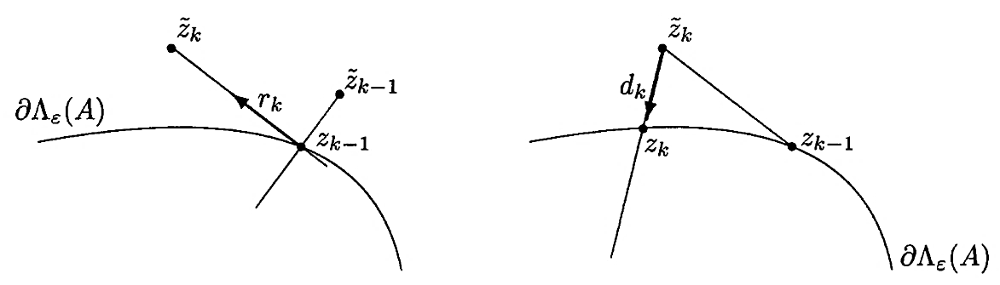
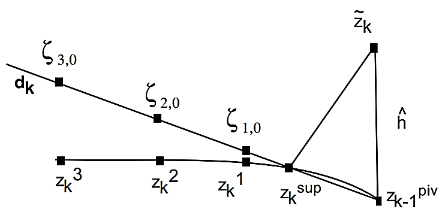
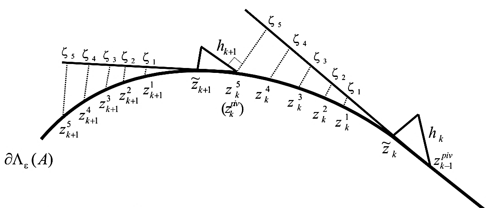
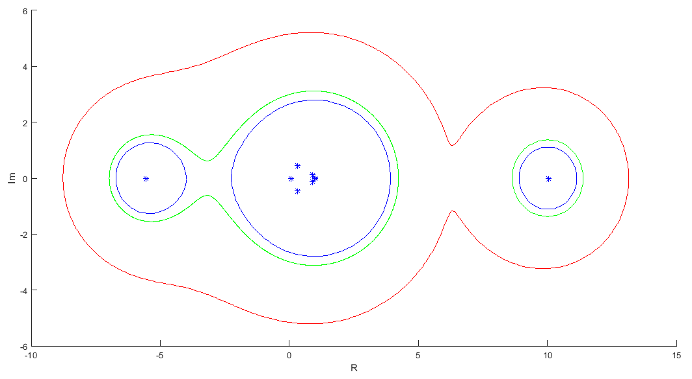
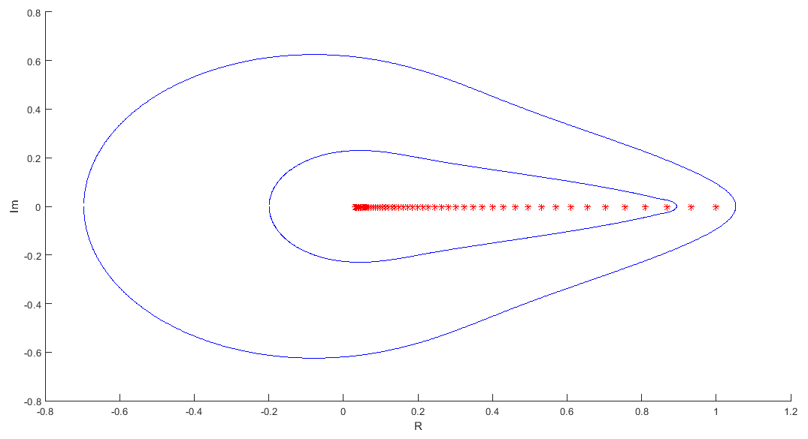
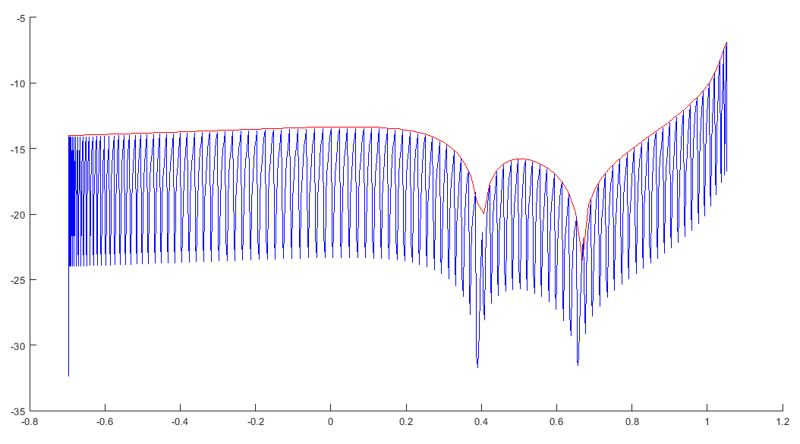
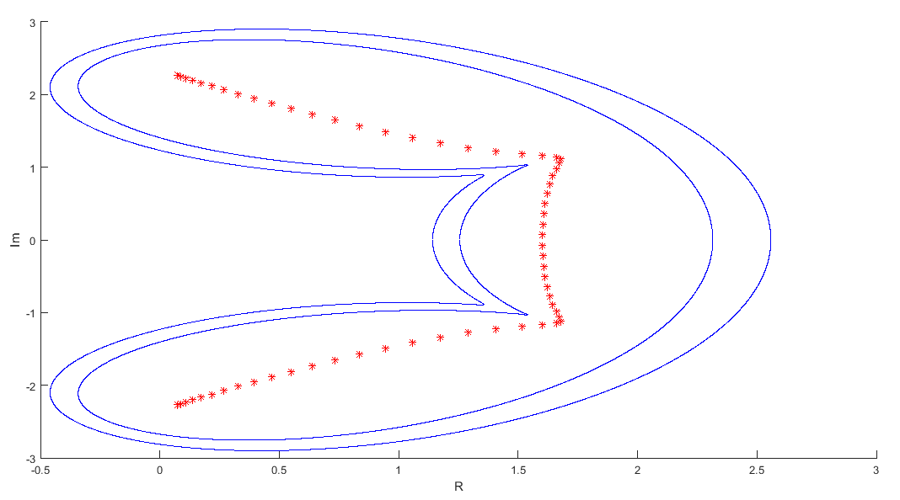

# Path-Following-Methods-For-Computing-Pseudospectra
Includes simple Path Following method (PF) and Cobra method for computing the pseudospectra of a matrix

Classic Path Following method

Cobra Method

Example 1

Example 2

Example 2 - Error comparison between PF(red) and Cobra(blue)

Example 3

